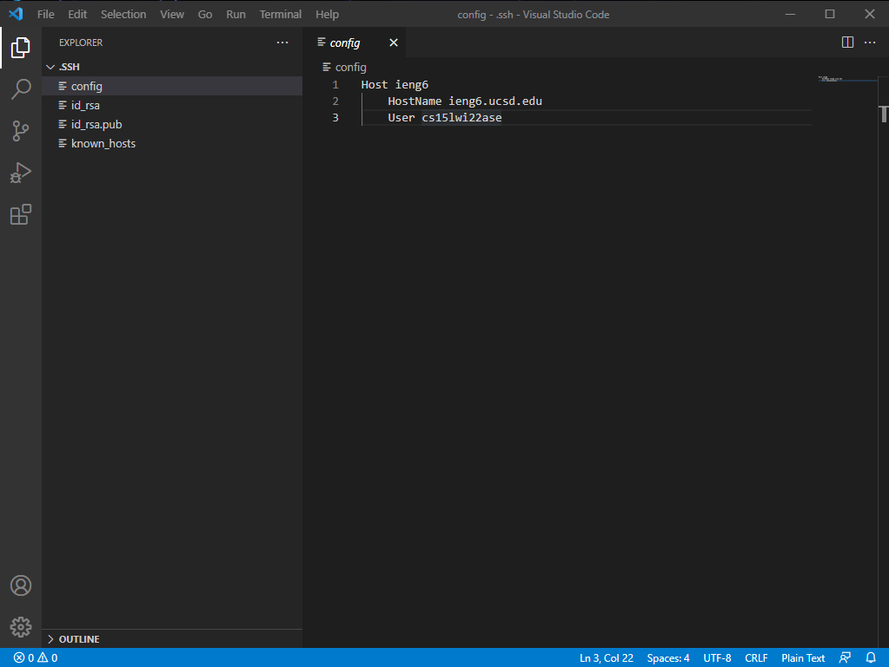
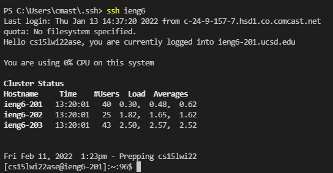
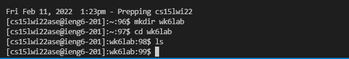

**Week 3 Lab Report**
=====================
- ## Streamlining ssh Configuration
- here is my ssh config file as I can see and edit it in VSCode
- 
- this is me logging on with the alias
- you can see there is no username or password, just the computer's name
- 
- this picture is here to show an empty folder that I want to ```scp``` a file into
- 
- finally, here I execute the ```scp``` command, then log onto ieng6 and check my folder that I moved the file into