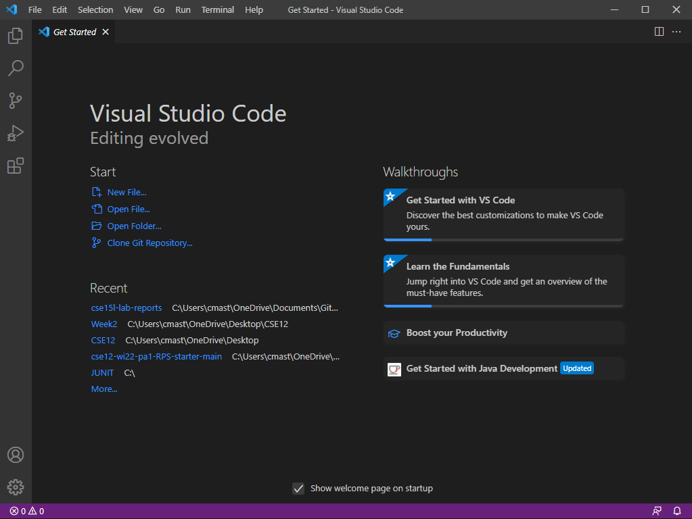
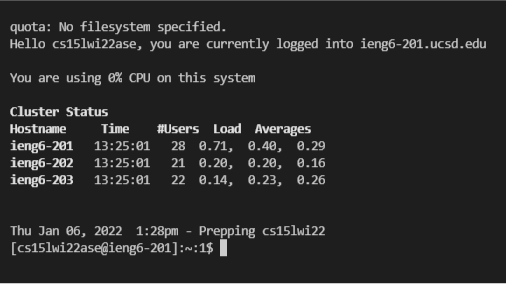
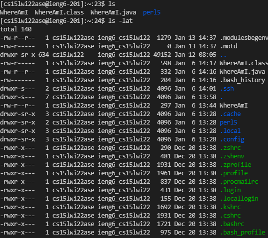
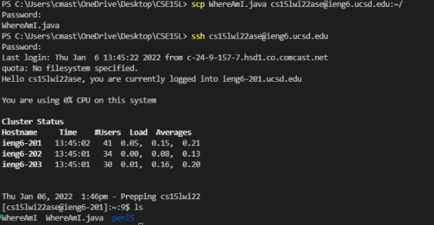
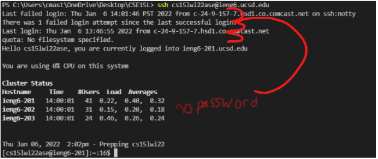
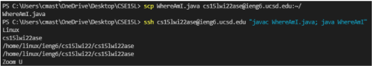

**Week 1 Lab Report**
=====================
- The fist step to getting started is downloading Visual Studio Code
- It should be donwloadable [here](https://code.visualstudio.com/download)
- When you download and install, use the wizard and then open the program
- If it worked it should look like this 
- The next thing we did was to remotely connect to a server 
- First install OpenSSH using instructions from the link [here](https://docs.microsoft.com/en-us/windows-server/administration/openssh/openssh_install_firstuse)
- then use the SSH command to remotely access the server
- my command looked like *ssh cs15lwi22arh@ieng6.ucsd.edu*
- type yes the first time you log in and then enter your password when promted
- no text shows up when typing so don't be alarmed, (and make sure not to mess up when you type in your password)
- Once you log on you should see this 
- 
- The server I logged into was linux based so we can run some linux commands as shown 
- In order to use this computer we need to upload files onto it.
- I used the command scp in order to upload a file
- my command looked like *scp WhereAmI.java cs15lwi22ase@ieng6.ucsd.edu:~/
- Here is a screenshot of my uploading a file, logging on and checking for it 
- From here on out, everything else will be devoted to speeding up the process.
- The next thing I did was to set up an ssh key with the command *ssh-keygen*
- Then i logged back onto the server and make a directory called .ssh with *mkdir .ssh*
- I then uploaded the public key from my pc to this directory with scp.
- I was then able to log on without typing my long password as shown here
- 
- I finished out with some optimization of the process of running a java file on the server
- I got the command for logging in, compiling, and running onto one line as shown here
- 
- Every time after that, when I want to run the code, I can use the up arrow to get that line back and run it very quickly
- After editing my code, I could press up then enter twice for 4 total keystrokes to upload and run my code on the server
