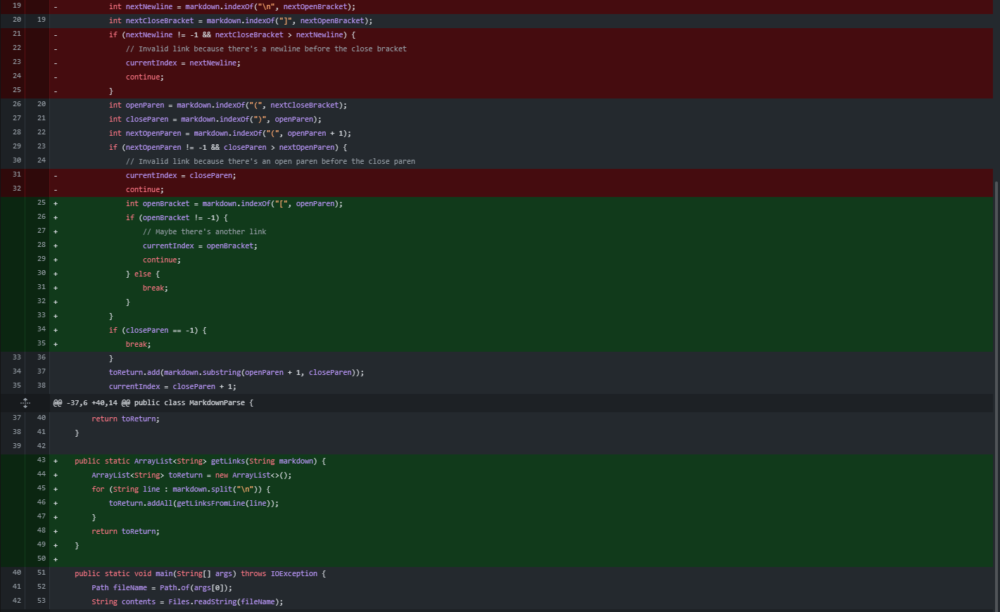
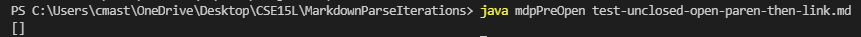

**Week 2 Lab Report**
=====================
- ## Fixing Extra parentheses inside link text
- 
- [extraParenTest](https://cmasterm.github.io/cse15l-lab-reports/lab2tests/test-parens-inside-link.md)
- symptom
- 
- The bug is that after detecting an open parenthesis, the first closed parenthesis is used and everything in between is a link
- the test has text inside parentheses within a link
- the symptom is that the link is detected as everything from the start of the link until the closed paranthesis within the link
- ## Fixing unclosed open paranthesis
- 
- [openParenTest](https://cmasterm.github.io/cse15l-lab-reports/lab2tests/test-unclosed-open-paren-then-link.md)
- symptom
- 
- The bug in the code is that after seeing two open parentheses, the code skips a closed because it always links innermost parentheses.
- Our test case has some improperly formatted links with only open parenthases before a properly formatted link with an open and closed paranthesis
- The symptom is that the proper links are ignored because our last change filters them out
- ## Fixing Images
- 
- [ignoreImageTest](https://cmasterm.github.io/cse15l-lab-reports/lab2tests/test-ignore-image.md)
- symptom 
- 
- The bug is that the code responsible for recognizing links, also recognized images as links due to similar formatting
- Our test has some dummy images and links that are named as such so we see what gets pulled through and printed
- the symptom is that all of the links as well as the image links get added when only the normal links should be added
- ##