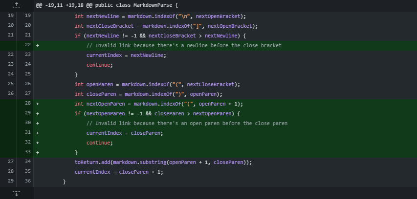

**Week 2 Lab Report**
=====================
- ## Fixing Open Paren Inside Link Text
- 
- [openParenTest](https://cmasterm.github.io/cse15l-lab-reports/lab2tests/test-unclosed-open-paren-then-link.md)
- symptom
- 
- The bug in the code is that after seing the proper brackets, the code looks for the first open and closed parentheses it can find and returning everything in between.
- Our test case has some improperly formatted links with only open parenthases before a properly formatted link with an open and closed paranthesis
- The symptom is that the improperly formatted links aren't ignored, and that a bunch of formatting garbage with the entire proper link is gathered and returned
- ## Fixing Images
- 
- [ignoreImageTest](https://cmasterm.github.io/cse15l-lab-reports/lab2tests/test-ignore-image.md)
- symptom 
- 
- The bug is that the code responsible for recognizing links, also recognized images as links due to similar formatting
- Our test has some dummy images and links that are named as such so we see what gets pulled through and printed
- the symptom is that all of the links as well as the image links get added when only the normal links should be added
- ##