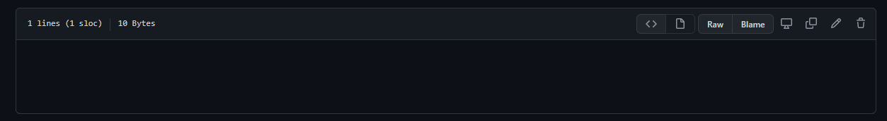

**Week 9 Lab Report**
=====================
- ## Different Test Methodology
- In order to find the differences between tests, we ran a bash script that used the directory compatability of Markdown-Parse and sent the result of every test to a file. We did this for our implementation and the provided implementation then we used the ```diff``` comand to compare them.
- ## Test 14
- our output
- 
- provided code output
- 
- github's interpretation: there are no links
- 
- our implementation is correct, and the provided 1 isn't. This is because the provided code doesn't properly handle backslash escapes. There was simply no attempt to implement them at all. I'm not exactly sure how to fufill the promt for an image, there isn't a specific place in the code where the bug exists. The proper code just isn't present. A method needs to be somewhere to detect escapes. Or a check needs to be added in the the getLinks(String markdown) method
- 
- ## Test 580
- our output
- 
- provided code output
- 
- github's interpretation
- 
- github doesn't recognize any links, meaning again our code is correct and the provided code isn't. This is due to the provided code being unable to differentiate between images and links. In order to fix this, the getLinks(String markdown) method needs to have an if statement checking if there is an '!' before the next open Bracket
- 